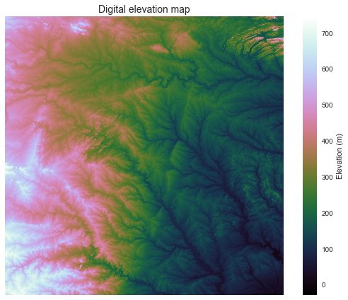
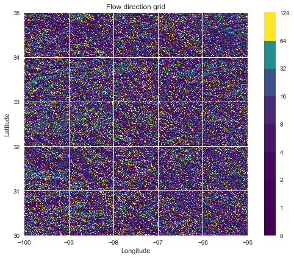
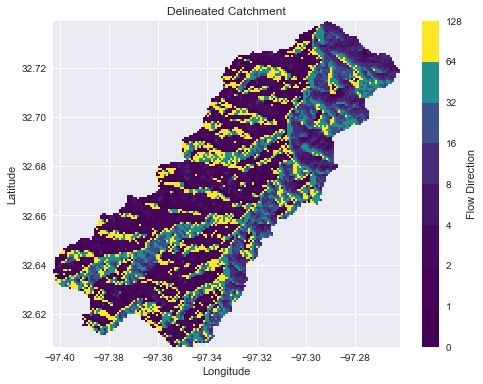
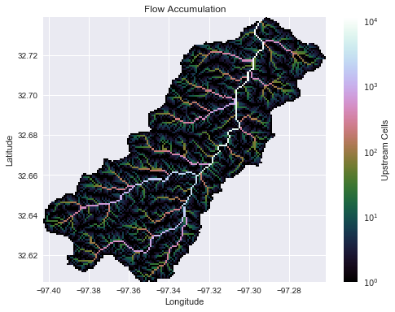
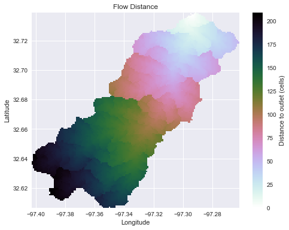
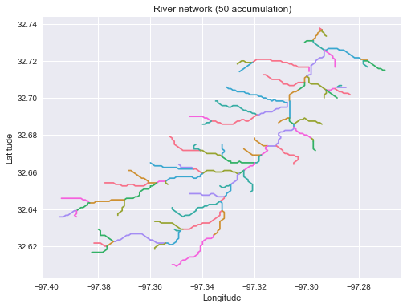
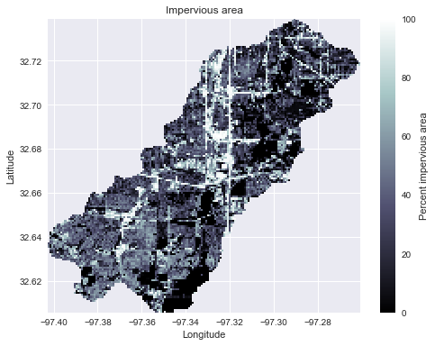
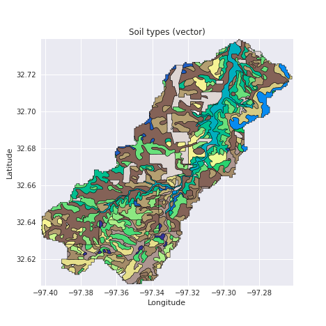
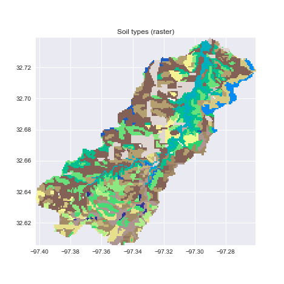

# pysheds [](https://travis-ci.org/mdbartos/pysheds) [](https://coveralls.io/github/mdbartos/pysheds?branch=master) [](https://www.python.org/downloads/release/python-370/)
🌎 Simple and fast watershed delineation in python.

## Documentation

Read the docs [here](https://mdbartos.github.io/pysheds).

## Media

*Hatari Labs* - [Elevation model conditioning and stream network delineation with python and pysheds](https://www.hatarilabs.com/ih-en/elevation-model-conditioning-and-stream-network-delimitation-with-python-and-pysheds-tutorial) <sup>:uk:</sup>

*Hatari Labs* - [Watershed and stream network delineation with python and pysheds](https://www.hatarilabs.com/ih-en/watershed-and-stream-network-delimitation-with-python-and-pysheds-tutorial) <sup>:uk:</sup>

*Gidahatari* - [Delimitación de límite de cuenca y red hidrica con python y pysheds](http://gidahatari.com/ih-es/delimitacion-de-limite-de-cuenca-y-red-hidrica-con-python-y-pysheds-tutorial) <sup>:es:</sup>

*Earth Science Information Partners* - [Pysheds: a fast, open-source digital elevation model processing library](https://www.esipfed.org/student-fellow-blog/pysheds-a-fast-open-source-digital-elevation-model-processing-library) <sup>:uk:</sup>

## Example usage

See [examples/quickstart](https://github.com/mdbartos/pysheds/blob/master/examples/quickstart.ipynb) for more details.

Data available via the [USGS HydroSHEDS](https://hydrosheds.cr.usgs.gov/datadownload.php) project.

### Read DEM data

```python
# Read elevation and flow direction rasters
# ----------------------------
from pysheds.grid import Grid

grid = Grid.from_raster('n30w100_con', data_name='dem')
grid.read_raster('n30w100_dir', data_name='dir')
grid.view('dem')
```



### Elevation to flow direction

```python
# Determine D8 flow directions from DEM
# ----------------------
# Fill depressions in DEM
grid.fill_depressions('dem', out_name='flooded_dem')
    
# Resolve flats in DEM
grid.resolve_flats('flooded_dem', out_name='inflated_dem')
    
# Specify directional mapping
dirmap = (64, 128, 1, 2, 4, 8, 16, 32)
    
# Compute flow directions
# -------------------------------------
grid.flowdir(data='inflated_dem', out_name='dir', dirmap=dirmap)
grid.view('dir')
```



### Delineate catchment from flow direction

```python
# Delineate a catchment
# ---------------------
# Specify pour point
x, y = -97.294167, 32.73750

# Delineate the catchment
grid.catchment(data='dir', x=x, y=y, dirmap=dirmap, out_name='catch',
               recursionlimit=15000, xytype='label')

# Crop and plot the catchment
# ---------------------------
# Clip the bounding box to the catchment
grid.clip_to('catch')
grid.view('catch')
```



### Compute accumulation from flow direction

```python
# Calculate flow accumulation
# --------------------------
grid.accumulation(data='catch', dirmap=dirmap, out_name='acc')
grid.view('acc')
```



### Compute flow distance from flow direction

```python
# Calculate distance to outlet from each cell
# -------------------------------------------
grid.flow_distance(data='catch', x=x, y=y, dirmap=dirmap,
                   out_name='dist', xytype='label')
grid.view('dist')
```



### Extract the river network

```python
# Extract river network
# ---------------------
branches = grid.extract_river_network(fdir='catch', acc='acc',
                                      threshold=50, dirmap=dirmap)
```



### Add land cover data

```python
# Combine with land cover data
# ---------------------
grid.read_raster('nlcd_2011_impervious_2011_edition_2014_10_10.img',
                  data_name='terrain', window=grid.bbox, window_crs=grid.crs)
grid.view('terrain')
```



### Add vector data

```python
# Convert catchment raster to vector and combine with soils shapefile
# ---------------------
# Read soils shapefile
import geopandas as gpd
from shapely import geometry, ops
soils = gpd.read_file('nrcs-soils-tarrant_439.shp')
# Convert catchment raster to vector geometry and find intersection
shapes = grid.polygonize()
catchment_polygon = ops.unary_union([geometry.shape(shape)
                                     for shape, value in shapes])
soils = soils[soils.intersects(catchment_polygon)]
catchment_soils = soils.intersection(catchment_polygon)
```



### Convert from vector to raster

```python
# Convert soils polygons to raster
# ---------------------
soil_polygons = zip(catchment_soils.geometry.values,
                    catchment_soils['soil_type'].values)
soil_raster = grid.rasterize(soil_polygons, fill=np.nan)
```



### Estimate inundation using the Rapid Flood Spilling Method

```python
# Estimate inundation extent
# ---------------------
from pysheds.rfsm import RFSM
grid = Grid.from_raster('roi.tif', data_name='dem')
grid.clip_to('dem')
dem = grid.view('dem')
cell_area = np.abs(grid.affine.a * grid.affine.e)
# Create RFSM instance
rfsm = RFSM(dem)
# Apply uniform rainfall to DEM
input_vol = 0.1 * cell_area * np.ones(dem.shape)
waterlevel = rfsm.compute_waterlevel(input_vol)
```


## Features

- Hydrologic Functions:
  - `flowdir`: DEM to flow direction.
  - `catchment`: Delineate catchment from flow direction.
  - `accumulation`: Flow direction to flow accumulation.
  - `flow_distance`: Compute flow distance to outlet.
  - `extract_river_network`: Extract river network at a given accumulation threshold.
  - `cell_area`: Compute (projected) area of cells.
  - `cell_distances`: Compute (projected) channel length within cells.
  - `cell_dh`: Compute the elevation change between cells.
  - `cell_slopes`: Compute the slopes of cells.
  - `fill_pits`: Fill simple pits in a DEM (single cells lower than their surrounding neighbors).
  - `fill_depressions`: Fill depressions in a DEM (regions of cells lower than their surrounding neighbors).
  - `resolve_flats`: Resolve drainable flats in a DEM using the modified method of Garbrecht and Martz (1997).
  - `compute_hand` : Compute the height above nearest drainage (HAND) as described in Nobre et al. (2011).
- Utilities:
  - `view`: Returns a view of a dataset at a given bounding box and resolution.
  - `clip_to`: Clip the current view to the extent of nonzero values in a given dataset.
  - `set_bbox`: Set the current view to a rectangular bounding box.
  - `snap_to_mask`: Snap a set of coordinates to the nearest masked cells (e.g. cells with high accumulation).
  - `resize`: Resize a dataset to a new resolution.
  - `rasterize`: Convert a vector dataset to a raster dataset.
  - `polygonize`: Convert a raster dataset to a vector dataset.
  - `detect_pits`: Return boolean array indicating locations of simple pits in a DEM.
  - `detect_flats`: Return boolean array indicating locations of flats in a DEM.
  - `detect_depressions`: Return boolean array indicating locations of depressions in a DEM.
  - `check_cycles`: Check for cycles in a flow direction grid.
  - `set_nodata`: Set nodata value for a dataset.
- I/O:
  - `read_ascii`: Reads ascii gridded data.
  - `read_raster`: Reads raster gridded data.
  - `to_ascii`: Write grids to delimited ascii files.
  - `to_raster`: Write grids to raster files (e.g. geotiff).

`pysheds` supports both D8 and D-infinity routing schemes.

## Installation

`pysheds` currently only supports Python 3.

### Using pip

You can install `pysheds` using pip:

```bash
$ pip install pysheds
```

### Using anaconda

First, add conda forge to your channels, if you have not already done so:

```bash
$ conda config --add channels conda-forge
```

Then, install pysheds:

```bash
$ conda install pysheds
```
### Installing from source

For the bleeding-edge version, you can install pysheds from this github repository.

```bash
$ git clone https://github.com/mdbartos/pysheds.git
$ cd pysheds
$ python setup.py install
```

or

```bash
$ git clone https://github.com/mdbartos/pysheds.git
$ cd pysheds
$ pip install .
```

# Performance
Performance benchmarks on a 2015 MacBook Pro:

- Flow Direction to Flow Accumulation: 36 million grid cells in 15 seconds.
- Flow Direction to Catchment: 9.8 million grid cells in 4.55 seconds.
