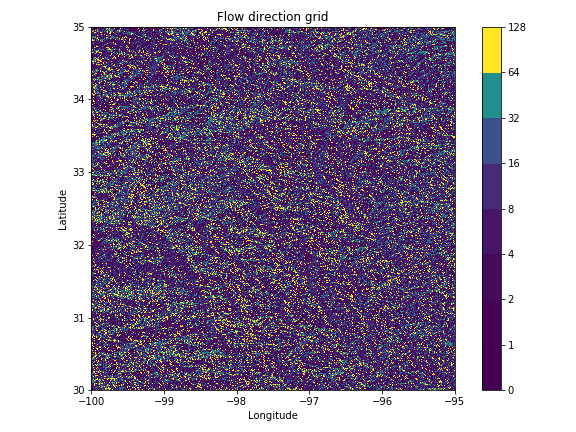
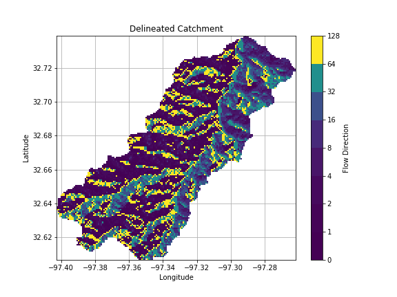
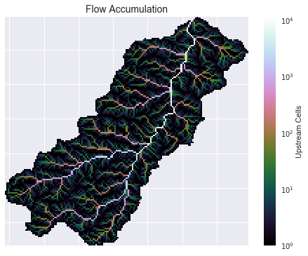
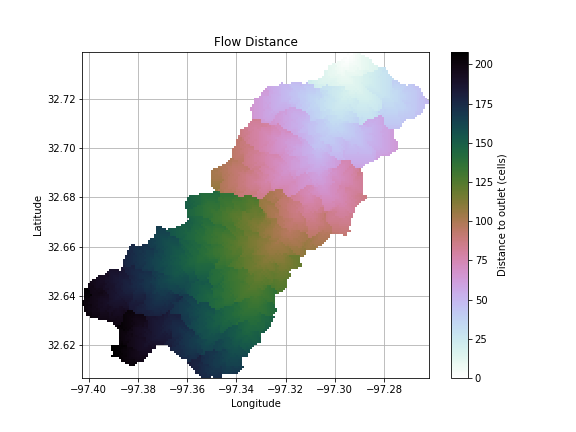

# pysheds
Simple and fast watershed delineation in python.

# Example usage

    Read a flow direction raster
    ----------------------------
    from pysheds.grid import Grid

    grid = Grid.from_raster('../data/n30w100_dir/n30w100_dir/w001001.adf',
                            data_name='dir', input_type='ascii')

    Delineate a catchment
    ---------------------
    # Specify pour point
    x, y = -97.2937, 32.7371
    # Specify directional mapping
    dirmap=(64, 128, 1, 2, 4, 8, 16, 32)

    # Delineate the catchment
    grid.catchment(x, y, dirmap=dirmap, recursionlimit=15000, 
                   xytype='label')

    Crop and plot the catchment
    ---------------------------
    # Clip the bounding box to the catchment
    grid.clip_to('catch', precision=5)

    Calculate flow accumulation
    --------------------------
    grid.accumulation(catch, dirmap=dirmap, pad_inplace=False)
    

    Calculate distance to outlet from each cell
    -------------------------------------------
    pour_point_y, pour_point_x = np.unravel_index(np.argmax(grid.view('catch')),
                                                  grid.shape)
    grid.flow_distance(pour_point_x, pour_point_y, dirmap=dirmap)

# To-do's:
- Float-based bbox indexing is problematic
- Add graph routines
